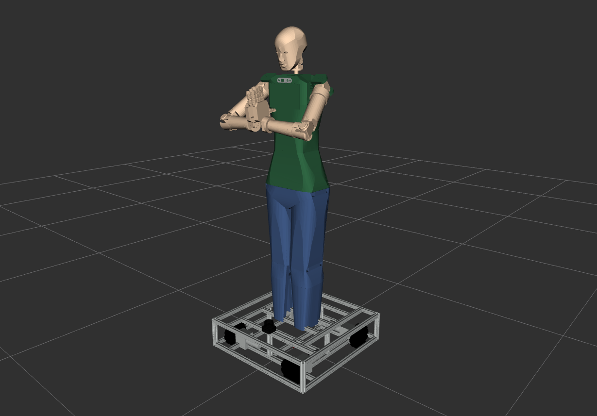
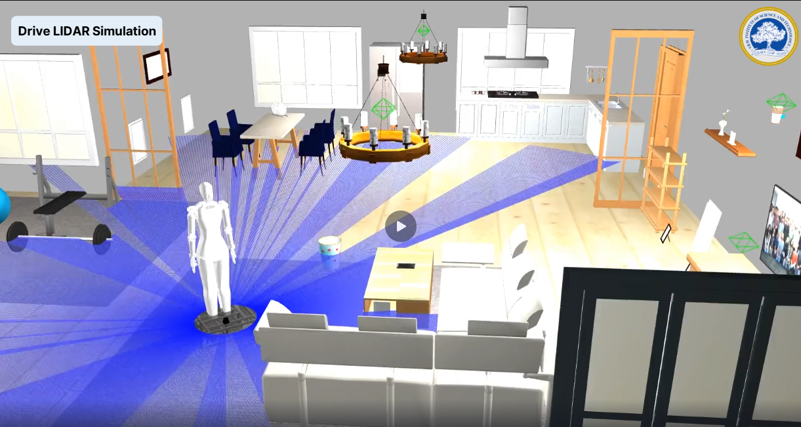
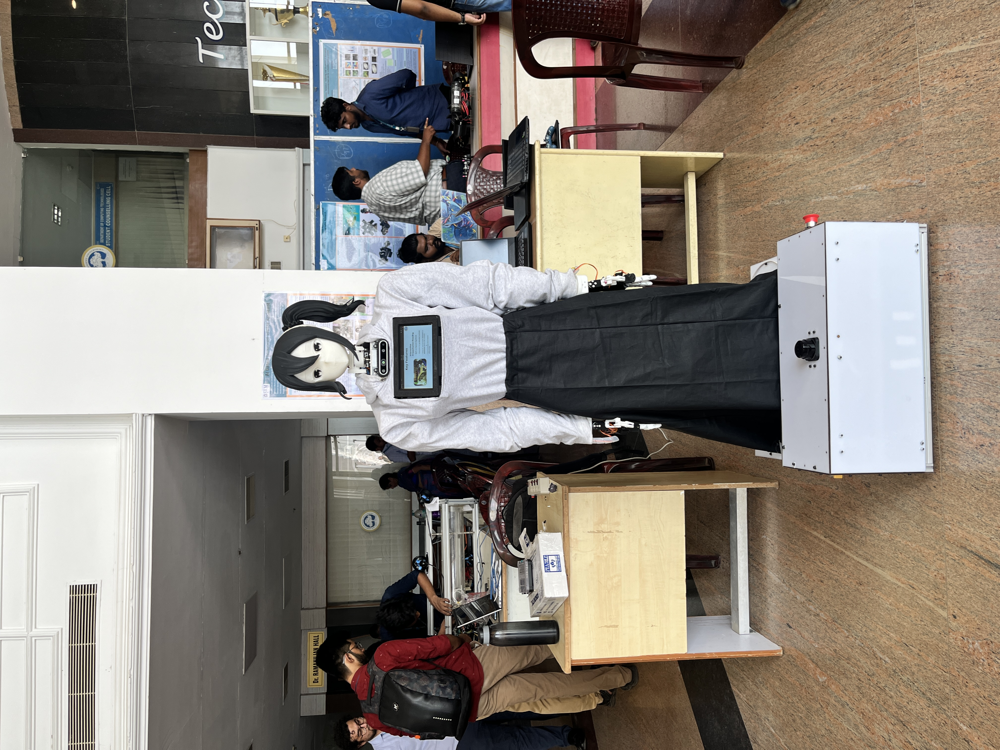

# Project EVA — Humanoid Robot

**EVA (Enhanced Visitor Assistant)** is a humanoid robot designed to function as an
autonomous visitor guide and professor assistant. Built as a B.Tech major project by
a team of 5, I was responsible for all embedded systems integration and ROS2 software
— from the Micro-ROS motor firmware to SLAM navigation and MoveIt2 arm control.

[](https://docs.ros.org/en/humble/)
[](LICENSE.md)

---

## Demo

> 📸 RViz + Gazebo screenshots, real world testing videos -> https://tinyurl.com/Project-EVA

| Full Robot (RViz) | Gazebo Simulation | Physical Build |
|---|---|---|
|  |  |  |

---

## What I Built

This wasn't a tutorial follow-along — here's what was actually custom-developed:

- **Custom drive kinematics node** — EVA uses a non-standard wheel configuration.
  I wrote a ROS2 node (`project_eva_drive`) that translates `cmd_vel` messages into
  per-wheel motor commands for this specific geometry, something Nav2 doesn't handle
  out of the box.

- **Micro-ROS embedded firmware** — The robotic arms are controlled by a
  microcontroller running Micro-ROS. This bridges the ROS2 graph directly to the arm motor drivers over
  serial, enabling real-time joint control from MoveIt2.

- **MoveIt2 arm configuration** — Configured MoveIt2 for EVA's custom arm URDF,
  including SRDF, kinematics solver setup, and motion planning for both arms with
  finger actuation.

- **Full URDF from scratch** — Modelled the entire robot in URDF/Xacro: body,
  dual arms, finger joints, and the custom drive base. Verified in RViz and simulated
  in Gazebo with ros2_control.

- **Autonomous navigation** — Integrated Nav2 with SLAM Toolbox for indoor
  navigation. Used RPlidar, camera, and IMU fusion for localization.

- **Voice interaction system** — Built an NLP-based command interface allowing
  visitors to interact with EVA using natural language.

---

## System Architecture

```
Voice Input ──► NLP Node ──► Task Planner
                                  │
                    ┌─────────────┼──────────────┐
                    ▼             ▼               ▼
              Nav2 Stack     MoveIt2 Arms     TTS Response
                    │             │
                    ▼             ▼
             Drive Node    Micro-ROS Bridge
                    │             │
             Motor Drivers   Arm Motor Drivers
```

---

## Hardware

| Component | Details |
|---|---|
| Compute | Raspberry Pi & Jetson (ROS2) + Teensy (Micro-ROS) |
| LiDAR | RPLidar A2 |
| Camera | Intel RealSense |
| IMU | BNO055 |
| Drive | Custom omni base|
| Arms | servo & DC motor|
| Body | Custom 3D printed + machined frame |

---

## ROS2 Package Structure

```
project_eva/          — URDF, launch files, robot description
project_eva_drive/    — Custom drive kinematics controller
project_eva_controller/ — Micro-ROS bridge for arm control
project_eva_moveit/   — MoveIt2 config (SRDF, kinematics, planning)
```

---

## Getting Started

### Prerequisites
- ROS2 Humble
- MoveIt2
- Nav2
- SLAM Toolbox
- Micro-ROS (for embedded arm control)

### Build

```bash
mkdir -p ~/project_eva_ws/src && cd ~/project_eva_ws/src
git clone https://github.com/The-Kriz/project_eva
cd ..
colcon build --symlink-install
source install/setup.bash
```

### Run

**Simulation (Gazebo + RViz):**
```bash
ros2 launch project_eva launch_sim.launch.py use_sim_time:=true use_omni_wheel:=true use_drive:=true use_eva:=true
```

**Robot State Publisher only:**
```bash
ros2 launch project_eva rsp.launch.py use_sim_time:=true use_omni_wheel:=false use_drive:=true use_eva:=true
```

---

## Skills Demonstrated

`ROS2` `MoveIt2` `Nav2` `SLAM` `Micro-ROS` `URDF/Xacro` `Gazebo`
`Embedded C/C++` `Custom Kinematics` `Sensor Fusion` `NLP` `Python` `C++`

---

## Team

Built by a team of 5 at SRM Institute of Science and Technology (B.Tech Major Project, 2024).
My scope: all ROS2 software, embedded firmware, and hardware integration.

---

*Part of my robotics portfolio — see also [rog_ros_bot](https://github.com/The-Kriz/rog_ros_bot)*


## 1 Start
### 1.1 Download

    cd $HOME
    mkdir project/src
    cd project/src
    git clone https://github.com/The-Kriz/project_eva

### 1.2 Build

    colcon build --symlink-install
    source install/setup.bash
    
### 1.2 Run

#### 1.2.1 Run Robot State Publisher
    ros2 launch project_eva rsp.launch.py use_sim_time:=true use_omni_wheel:=false use_drive:=true use_eva:=true


#### 1.2.2 Run Robot Simulation
    ros2 launch project_eva launch_sim.launch.py use_sim_time:=true use_omni_wheel:=true use_drive:=true use_eva:=true

## 2 URDF

### 2.1 Drive


### 2.2 Arm


### 2.3 Fingers


### 2.4 EVA


## 3 POSE


